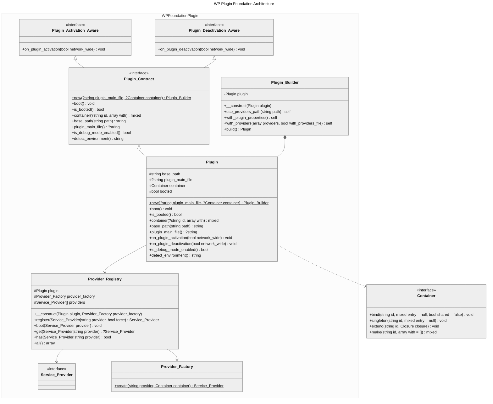

# Architecture

This page describes the components that make up WP Plugin Foundation and how they collaborate.

## UML Diagram



## Components

### Core

| Class | Role |
|---|---|
| `Plugin` | Central class. Manages plugin state, container access, and lifecycle hooks. Entry point via `Plugin::new()`. |
| `Plugin_Builder` | Fluent builder returned by `Plugin::new()`. Configures paths, plugin properties, and service providers before calling `build()`. |

### Provider System

| Class | Role |
|---|---|
| `Service_Provider` (interface) | Marker contract that all provider classes must implement. |
| `Service_Provider` (abstract) | Base class providing `register()`, `boot()`, and `$this->container` access. Extend this for convenience. |
| `Provider_Registry` | Manages registration, container binding (`BINDINGS` / `SINGLETONS`), and booting of all providers. |
| `Provider_Factory` | Creates provider instances from class names with automatic container injection. |

### Contracts

| Interface | Role |
|---|---|
| `Plugin` (contract) | Defines the full plugin API: `boot()`, `container()`, `base_path()`, lifecycle hooks. |
| `Plugin_Activation_Aware` | Implement on a provider to react to plugin activation. |
| `Plugin_Deactivation_Aware` | Implement on a provider to react to plugin deactivation. |

### Support

| Class | Role |
|---|---|
| `Utilities` | Resolves plugin base paths and loads plugin header data (`get_plugin_data()`). |
| `Requirements_Validator` | Validates required files exist before the autoloader is loaded. |

### Exceptions

| Class | Extends | When Thrown |
|---|---|---|
| `Failed_Initialization_Exception` | `RuntimeException` | Invalid paths, missing plugin main file. |
| `Invalid_Provider_Exception` | `InvalidArgumentException` | Non-existent or invalid service provider classes. |

## Request Flow

```
Main Plugin File
│
├─ Requirements_Validator::check()     ← Verify vendor/autoload.php (and any additional files) exist
├─ require vendor/autoload.php
│
├─ Plugin::new( __FILE__ )             ← Create Plugin + Plugin_Builder
│   ├─ →with_plugin_properties()       ← Bind plugin header metadata to container
│   ├─ →with_providers()               ← Discover + register service providers
│   └─ →build()                        ← Return configured Plugin instance
│
├─ register_activation_hook()          ← on_plugin_activation → providers
├─ register_deactivation_hook()        ← on_plugin_deactivation → providers
│
└─ add_action( 'plugins_loaded' )
    └─ $plugin->boot()                 ← Calls boot() on every registered provider
```

## Provider Registration Flow

When `Provider_Registry::register()` is called with a provider:

1. **Deduplication**: If the provider is already registered and `$force` is false, return the existing instance.
2. **Instantiation**: If a class name string is passed, `Provider_Factory::create()` instantiates it with the container.
3. **Bindings**: If the provider defines a `BINDINGS` constant, each entry is bound to the container.
4. **Singletons**: If the provider defines a `SINGLETONS` constant, each entry is registered as a singleton.
5. **Register**: If the provider has a `register()` method, it is called.
6. **Late boot**: If the plugin is already booted, `boot()` is called immediately on the new provider.
